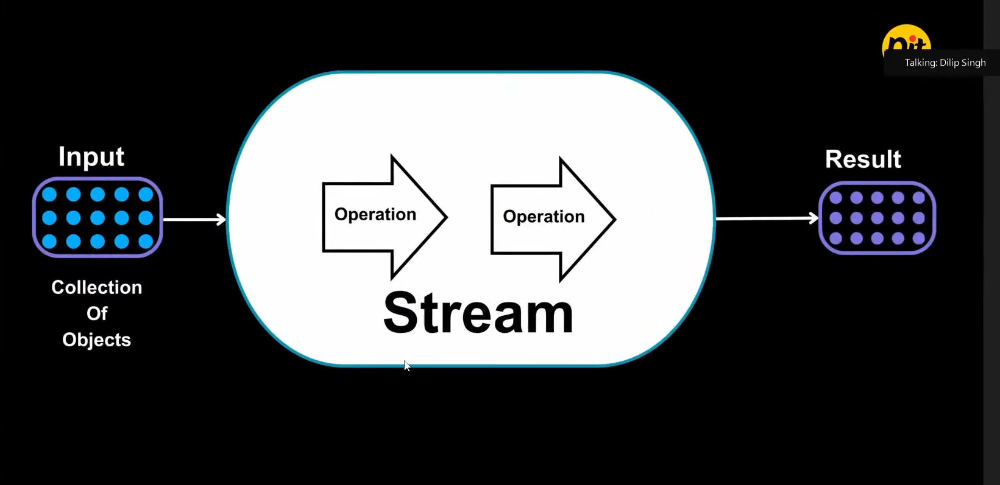
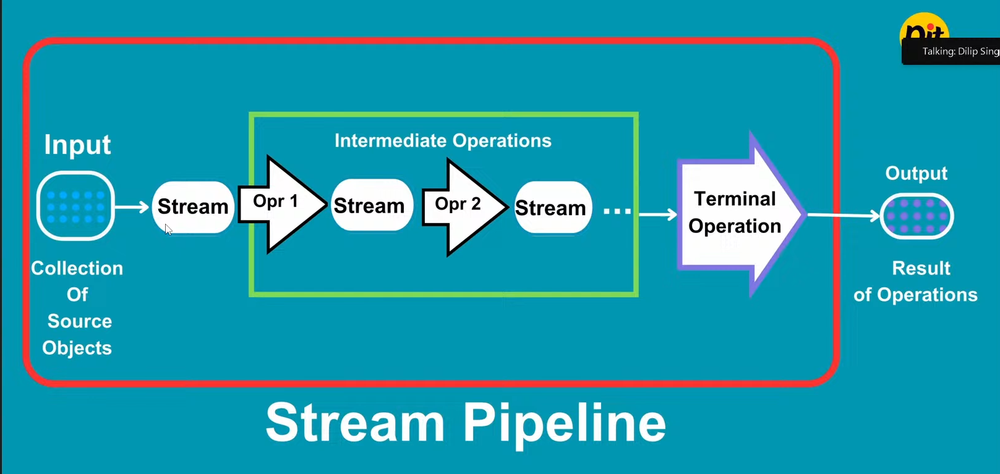

# 🌊 Java Stream API — Complete Notes

> **Java 8 Feature** | Package: `java.util.stream`
>
> _"Process collections of data in a declarative, functional style."_

---

## 📌 Table of Contents

1. [What is Stream API?](#1--what-is-stream-api)
2. [Why Stream API was Introduced](#2--why-stream-api-was-introduced)
3. [Difference between Collections and Streams](#3--difference-between-collections-and-streams)
4. [Characteristics of Streams](#4--characteristics-of-streams)
5. [How Streams Work Internally](#5--how-streams-work-internally)
6. [Stream Pipeline](#6--stream-pipeline)
7. [Lazy Evaluation](#7--lazy-evaluation)
8. [Stream Creation Methods](#8--stream-creation-methods)
9. [Intermediate Operations](#9--intermediate-operations)
10. [Terminal Operations](#10--terminal-operations)
11. [Optional with Streams](#11--optional-with-streams)
12. [Primitive Streams](#12--primitive-streams)
13. [Parallel Streams](#13--parallel-streams)
14. [Best Practices](#14--best-practices)
15. [Common Mistakes](#15--common-mistakes)
16. [Interview Questions](#16--interview-questions)
17. [Quick Revision Cheat Sheet](#17--quick-revision-cheat-sheet)
18. [Important Points to Remember](#18--important-points-to-remember)

---

## 1. 🔹 What is Stream API?

### Simple Definition

A **Stream** is a **sequence of elements** from a source (like a Collection, array, or I/O channel) that supports **aggregate operations** (filter, map, sort, reduce, etc.) to process data in a **functional style**.

> 💡 **Think of it like this:** A Stream is like a **conveyor belt** in a factory. Items (data) go on the belt, pass through different machines (operations like filter, sort, map), and come out as finished products (results).

### Key Points

- Introduced in **Java 8** under `java.util.stream` package.
- It does **NOT store data** — it processes data from a source.
- It does **NOT modify the original source** — it produces a new result.
- It works on the principle of **"What to do"**, not **"How to do"**.



### Simple Example

```java
import java.util.*;
import java.util.stream.*;

public class StreamDemo {
    public static void main(String[] args) {
        List<String> names = Arrays.asList("Sanket", "Amit", "Priya", "Rahul", "Amit");

        // Using Stream to filter names starting with "A"
        List<String> result = names.stream()
                                   .filter(name -> name.startsWith("A"))
                                   .collect(Collectors.toList());

        System.out.println(result);
    }
}
```

**Output:**
```
[Amit, Amit]
```

**Explanation:** We created a stream from the `names` list, filtered only those names starting with `"A"`, and collected the results into a new list. The original list `names` remains unchanged.

---

## 2. 🔹 Why Stream API was Introduced

Before Java 8, if you wanted to process a collection (like filtering, sorting, or transforming), you had to write **verbose, boilerplate code** using loops.

### ❌ Without Streams (Before Java 8)

```java
List<String> names = Arrays.asList("Sanket", "Amit", "Priya", "Rahul");
List<String> filtered = new ArrayList<>();

for (String name : names) {
    if (name.startsWith("A")) {
        filtered.add(name);
    }
}
System.out.println(filtered); // [Amit]
```

### ✅ With Streams (Java 8+)

```java
List<String> filtered = names.stream()
                             .filter(name -> name.startsWith("A"))
                             .collect(Collectors.toList());
System.out.println(filtered); // [Amit]
```

### Why it was needed

| Problem (Before Java 8) | Solution (Stream API) |
|---|---|
| Verbose, long code with loops | Concise, readable one-liners |
| Imperative style ("how to do") | Declarative style ("what to do") |
| Hard to parallelize processing | Easy `.parallelStream()` support |
| No built-in bulk operations | Built-in filter, map, reduce, etc. |
| Mixes "what" with "how" | Clean separation of concerns |

---

## 3. 🔹 Difference between Collections and Streams

| Feature | Collection | Stream |
|---|---|---|
| **Purpose** | Store & manage data | Process data |
| **Storage** | Stores elements in memory | Does NOT store elements |
| **Data modification** | Can add/remove elements | Cannot modify source |
| **Iteration** | External (you write loops) | Internal (Stream handles it) |
| **Traversal** | Can be traversed multiple times | Can be traversed **only once** |
| **Lazy** | Eagerly constructed | Lazily evaluated |
| **Infinite** | Always finite | Can be infinite |
| **Parallelism** | Need to manage threads manually | Built-in parallel support |

### Simple Analogy

- **Collection** = A **water tank** (stores water)
- **Stream** = A **water pipe** (water flows through it, processed, and comes out)

```
┌──────────────┐        ┌──────────────┐
│  Collection  │        │    Stream    │
│              │        │              │
│  Stores data │ ──────▶│ Processes    │
│  in memory   │        │ data on-the- │
│              │        │ fly          │
└──────────────┘        └──────────────┘
     (Tank)                  (Pipe)
```

---

## 4. 🔹 Characteristics of Streams

1. **Not a Data Structure** — Streams don't store data; they carry data from a source through a pipeline of operations.

2. **Functional in Nature** — Operations on a stream produce a result but do **not modify the source**.

3. **Lazily Evaluated** — Intermediate operations are not executed until a terminal operation is invoked.

4. **Possibly Unbounded** — Streams can be infinite (e.g., `Stream.generate()`, `Stream.iterate()`).

5. **Consumable** — A stream can be consumed (traversed) only **once**. After a terminal operation, the stream is considered closed.

6. **Support Parallelism** — Streams can easily run in parallel using `.parallelStream()` or `.parallel()`.

```java
// ❌ This will throw IllegalStateException!
Stream<String> stream = names.stream();
stream.forEach(System.out::println);  // First use — OK
stream.forEach(System.out::println);  // Second use — ERROR!
```

---

## 5. 🔹 How Streams Work Internally

When you call `.stream()` on a collection, here's what happens:

```
Step 1:  Source (Collection/Array) creates a Stream
Step 2:  Intermediate operations are CHAINED (but NOT executed yet)
Step 3:  A Terminal operation TRIGGERS the entire pipeline
Step 4:  Each element passes through ALL operations one-by-one
Step 5:  Result is produced
```

### Important: Element-by-Element Processing

Streams do **NOT** process all elements through one operation, then pass them to the next. Instead, **each element travels through the entire pipeline** before the next element starts.

```
Element 1  →  filter()  →  map()  →  collect()
Element 2  →  filter()  →  (filtered out, stops here)
Element 3  →  filter()  →  map()  →  collect()
...
```

> 💡 **Think of it like:** Each student going through a complete examination process (registration → exam → result) one by one, NOT all students registering first, then all taking the exam, etc.

---

## 6. 🔹 Stream Pipeline

A Stream pipeline consists of **3 parts**:

```
┌────────────┐    ┌──────────────────────┐    ┌──────────────────┐
│   SOURCE   │───▶│ INTERMEDIATE OPS     │───▶│ TERMINAL OP      │
│            │    │ (0 or more)          │    │ (exactly 1)      │
│ Collection │    │ filter(), map(),     │    │ collect(),       │
│ Array      │    │ sorted(), distinct() │    │ forEach(),       │
│ Stream.of()│    │ ...                  │    │ reduce(), ...    │
└────────────┘    └──────────────────────┘    └──────────────────┘
```



### Three Parts Explained

| Part | Description | Returns | Example |
|---|---|---|---|
| **Source** | Where data comes from | Stream | `list.stream()` |
| **Intermediate Op** | Transforms the stream | Another Stream | `.filter()`, `.map()` |
| **Terminal Op** | Produces a result or side-effect | Non-stream (result) | `.collect()`, `.forEach()` |

### Complete Pipeline Example

```java
List<Employee> employees = Arrays.asList(
    new Employee("Sanket", 55000),
    new Employee("Amit", 45000),
    new Employee("Priya", 70000),
    new Employee("Rahul", 30000)
);

// Pipeline: Source → filter → map → sorted → collect
List<String> highEarners = employees.stream()              // Source
    .filter(e -> e.getSalary() > 40000)                    // Intermediate
    .map(Employee::getName)                                // Intermediate
    .sorted()                                              // Intermediate
    .collect(Collectors.toList());                         // Terminal

System.out.println(highEarners);
// Output: [Amit, Priya, Sanket]
```

### ASCII Diagram — Full Pipeline Flow

```
employees (List)
      │
      ▼
  stream()          ← Source
      │
      ▼
  filter()          ← Intermediate (salary > 40000)
      │
      ▼
  map()             ← Intermediate (get name)
      │
      ▼
  sorted()          ← Intermediate (alphabetical)
      │
      ▼
  collect()         ← Terminal (to List)
      │
      ▼
  [Amit, Priya, Sanket]   ← Result
```

---

## 7. 🔹 Lazy Evaluation

### What is Lazy Evaluation?

Intermediate operations are **not executed immediately** when you call them. They are only executed **when a terminal operation is invoked**.

### Why is this important?

- **Performance Optimization** — Only processes what is needed.
- **Short-circuiting** — Can stop early if the result is already found.
- Avoids unnecessary computation.

### Example — Proving Laziness

```java
List<String> names = Arrays.asList("Sanket", "Amit", "Priya", "Rahul");

// No terminal operation — NOTHING happens!
Stream<String> stream = names.stream()
    .filter(name -> {
        System.out.println("Filtering: " + name);
        return name.startsWith("A");
    });

System.out.println("Terminal operation not called yet...");

// NOW the terminal operation triggers execution
stream.forEach(System.out::println);
```

**Output:**
```
Terminal operation not called yet...
Filtering: Sanket
Filtering: Amit
Amit
Filtering: Priya
Filtering: Rahul
```

**Explanation:** The `filter()` was defined but did NOT execute until `forEach()` (the terminal operation) was called. Notice the `"Terminal operation not called yet..."` message printed **before** any filtering happened.

---

## 8. 🔹 Stream Creation Methods

There are multiple ways to create a stream:

### 8.1 From a Collection

```java
List<String> names = Arrays.asList("Sanket", "Amit", "Priya");
Stream<String> stream = names.stream();
```

### 8.2 From an Array

```java
String[] arr = {"Java", "Python", "C++"};
Stream<String> stream = Arrays.stream(arr);
```

### 8.3 Using `Stream.of()`

```java
Stream<String> stream = Stream.of("A", "B", "C");
```

### 8.4 Using `Stream.empty()`

```java
Stream<String> emptyStream = Stream.empty();
```

### 8.5 Using `Stream.generate()` (Infinite Stream)

```java
// Generates infinite random numbers
Stream<Double> randoms = Stream.generate(Math::random);
randoms.limit(3).forEach(System.out::println);
```

### 8.6 Using `Stream.iterate()` (Infinite Stream)

```java
// 0, 2, 4, 6, 8, ...
Stream<Integer> evens = Stream.iterate(0, n -> n + 2);
evens.limit(5).forEach(System.out::println);
// Output: 0 2 4 6 8
```

### 8.7 From a String (Characters)

```java
IntStream chars = "Hello".chars();
chars.forEach(c -> System.out.print((char) c + " "));
// Output: H e l l o
```

### 8.8 From a File (Java NIO)

```java
Stream<String> lines = Files.lines(Paths.get("data.txt"));
```

### Summary Table

| Method | Type | Finite/Infinite |
|---|---|---|
| `collection.stream()` | From Collection | Finite |
| `Arrays.stream(array)` | From Array | Finite |
| `Stream.of(values)` | From Values | Finite |
| `Stream.empty()` | Empty Stream | Finite |
| `Stream.generate(supplier)` | Supplier-based | Infinite |
| `Stream.iterate(seed, func)` | Iterative | Infinite |
| `Files.lines(path)` | From File | Finite |

---

## 9. 🔹 Intermediate Operations

Intermediate operations **transform a stream** into another stream. They are **lazy** — they don't execute until a terminal operation is called.

> 💡 All intermediate operations return a `Stream<T>`, so they can be **chained**.

---

### 9.1 `filter(Predicate<T>)`

**What:** Filters elements based on a condition. Keeps elements that match, removes those that don't.

**Syntax:** `stream.filter(element -> condition)`

```java
List<Student> students = Arrays.asList(
    new Student("Sanket", 85),
    new Student("Amit", 42),
    new Student("Priya", 91),
    new Student("Rahul", 38)
);

// Get students who passed (marks >= 50)
List<Student> passed = students.stream()
    .filter(s -> s.getMarks() >= 50)
    .collect(Collectors.toList());

System.out.println(passed);
// Output: [Student{name='Sanket', marks=85}, Student{name='Priya', marks=91}]
```

**Explanation:** Only students with marks ≥ 50 pass through the filter. Amit (42) and Rahul (38) are filtered out.

```
[Sanket:85, Amit:42, Priya:91, Rahul:38]
              │
        filter(marks >= 50)
              │
        [Sanket:85, Priya:91]
```

---

### 9.2 `map(Function<T, R>)`

**What:** Transforms each element into something else. It applies a function to each element and returns a new stream of transformed elements.

**Syntax:** `stream.map(element -> transformedElement)`

```java
List<Employee> employees = Arrays.asList(
    new Employee("Sanket", 55000),
    new Employee("Amit", 45000),
    new Employee("Priya", 70000)
);

// Extract only the names
List<String> names = employees.stream()
    .map(Employee::getName)
    .collect(Collectors.toList());

System.out.println(names);
// Output: [Sanket, Amit, Priya]
```

**Explanation:** `map()` takes each `Employee` object and extracts its name, converting `Stream<Employee>` → `Stream<String>`.

```
[Employee1, Employee2, Employee3]
              │
       map(getName)
              │
   ["Sanket", "Amit", "Priya"]
```

---

### 9.3 `flatMap(Function<T, Stream<R>>)`

**What:** Flattens nested structures. If each element maps to a stream (or collection), `flatMap()` merges them all into a single flat stream.

**Why needed:** When `map()` gives you a `Stream<Stream<T>>`, you need `flatMap()` to flatten it to `Stream<T>`.

**Syntax:** `stream.flatMap(element -> streamOfElements)`

```java
List<List<String>> nestedList = Arrays.asList(
    Arrays.asList("Java", "Python"),
    Arrays.asList("C++", "Go"),
    Arrays.asList("Rust", "Kotlin")
);

// Flatten into a single list
List<String> flatList = nestedList.stream()
    .flatMap(Collection::stream)
    .collect(Collectors.toList());

System.out.println(flatList);
// Output: [Java, Python, C++, Go, Rust, Kotlin]
```

**Explanation:**

```
map() would give:     Stream< Stream<String> >
                      [[Java, Python], [C++, Go], [Rust, Kotlin]]

flatMap() gives:      Stream<String>
                      [Java, Python, C++, Go, Rust, Kotlin]
```

### Real-World Example

```java
List<Student> students = Arrays.asList(
    new Student("Sanket", Arrays.asList("Math", "Science")),
    new Student("Priya", Arrays.asList("English", "Math", "Art"))
);

// Get all unique subjects across all students
List<String> allSubjects = students.stream()
    .flatMap(s -> s.getSubjects().stream())
    .distinct()
    .collect(Collectors.toList());

System.out.println(allSubjects);
// Output: [Math, Science, English, Art]
```

---

### 9.4 `distinct()`

**What:** Removes duplicate elements from the stream. Uses `.equals()` method to check duplicates.

```java
List<String> cities = Arrays.asList("Pune", "Mumbai", "Pune", "Delhi", "Mumbai");

List<String> uniqueCities = cities.stream()
    .distinct()
    .collect(Collectors.toList());

System.out.println(uniqueCities);
// Output: [Pune, Mumbai, Delhi]
```

> ⚠️ **Note:** For custom objects, you must override `equals()` and `hashCode()` for `distinct()` to work correctly.

---

### 9.5 `sorted()` and `sorted(Comparator)`

**What:** Sorts elements in the stream.
- `sorted()` — Natural order (alphabetical for Strings, ascending for numbers)
- `sorted(Comparator)` — Custom order

```java
// Natural sorting
List<String> names = Arrays.asList("Priya", "Amit", "Sanket", "Rahul");
List<String> sorted = names.stream()
    .sorted()
    .collect(Collectors.toList());
System.out.println(sorted);
// Output: [Amit, Priya, Rahul, Sanket]
```

```java
// Custom sorting — by salary descending
List<Employee> sortedBysalary = employees.stream()
    .sorted(Comparator.comparingDouble(Employee::getSalary).reversed())
    .collect(Collectors.toList());
```

---

### 9.6 `peek(Consumer<T>)`

**What:** Performs an action on each element **without modifying the stream**. Mainly used for **debugging**.

```java
List<String> result = names.stream()
    .filter(name -> name.length() > 4)
    .peek(name -> System.out.println("Filtered: " + name))
    .map(String::toUpperCase)
    .peek(name -> System.out.println("Mapped: " + name))
    .collect(Collectors.toList());
```

**Output:**
```
Filtered: Sanket
Mapped: SANKET
Filtered: Priya
Mapped: PRIYA
Filtered: Rahul
Mapped: RAHUL
```

> 💡 **Tip:** `peek()` is very helpful for debugging. You can see what flows through each stage of the pipeline without breaking the chain.

---

### 9.7 `limit(long n)`

**What:** Truncates the stream to contain at most `n` elements.

```java
List<String> names = Arrays.asList("Sanket", "Amit", "Priya", "Rahul", "Neha");

List<String> firstThree = names.stream()
    .limit(3)
    .collect(Collectors.toList());

System.out.println(firstThree);
// Output: [Sanket, Amit, Priya]
```

---

### 9.8 `skip(long n)`

**What:** Skips the first `n` elements and returns the remaining.

```java
List<String> names = Arrays.asList("Sanket", "Amit", "Priya", "Rahul", "Neha");

List<String> afterSkipping = names.stream()
    .skip(2)
    .collect(Collectors.toList());

System.out.println(afterSkipping);
// Output: [Priya, Rahul, Neha]
```

### Pagination Example (skip + limit)

```java
int pageSize = 2;
int pageNumber = 2; // 0-indexed

List<String> page = names.stream()
    .skip((long) pageNumber * pageSize)
    .limit(pageSize)
    .collect(Collectors.toList());

System.out.println(page);
// Output: [Neha]  (page 2 with size 2 starting from index 4)
```

---

### 📊 Intermediate Operations — Summary Table

| Operation | Input | Output | Purpose |
|---|---|---|---|
| `filter(Predicate)` | `Stream<T>` | `Stream<T>` | Keep matching elements |
| `map(Function)` | `Stream<T>` | `Stream<R>` | Transform each element |
| `flatMap(Function)` | `Stream<T>` | `Stream<R>` | Flatten nested streams |
| `distinct()` | `Stream<T>` | `Stream<T>` | Remove duplicates |
| `sorted()` | `Stream<T>` | `Stream<T>` | Sort (natural order) |
| `sorted(Comparator)` | `Stream<T>` | `Stream<T>` | Sort (custom order) |
| `peek(Consumer)` | `Stream<T>` | `Stream<T>` | Debug / observe |
| `limit(n)` | `Stream<T>` | `Stream<T>` | Take first n elements |
| `skip(n)` | `Stream<T>` | `Stream<T>` | Skip first n elements |

---

## 10. 🔹 Terminal Operations

Terminal operations **trigger the processing** of the stream pipeline and **produce a result** (or side-effect). After a terminal operation, the stream is **consumed and closed**.

---

### 10.1 `forEach(Consumer<T>)`

**What:** Performs an action on each element. Does NOT return anything.

```java
List<String> names = Arrays.asList("Sanket", "Amit", "Priya");

names.stream()
     .forEach(name -> System.out.println("Hello, " + name));
```

**Output:**
```
Hello, Sanket
Hello, Amit
Hello, Priya
```

> ⚠️ `forEach()` is a terminal operation. You cannot chain anything after it.

---

### 10.2 `collect(Collector)`

**What:** Collects stream elements into a Collection, String, or other container. This is the **most commonly used** terminal operation.

#### Collect to List

```java
List<String> nameList = names.stream()
    .filter(n -> n.length() > 4)
    .collect(Collectors.toList());
```

#### Collect to Set

```java
Set<String> nameSet = names.stream()
    .collect(Collectors.toSet());
```

#### Collect to Map

```java
Map<String, Integer> studentMap = students.stream()
    .collect(Collectors.toMap(
        Student::getName,    // key
        Student::getMarks    // value
    ));
// {Sanket=85, Amit=42, Priya=91, Rahul=38}
```

#### Joining Strings

```java
String joined = names.stream()
    .collect(Collectors.joining(", "));
// Output: "Sanket, Amit, Priya"
```

#### Grouping By

```java
List<Employee> employees = Arrays.asList(
    new Employee("Sanket", "IT", 55000),
    new Employee("Amit", "HR", 45000),
    new Employee("Priya", "IT", 70000),
    new Employee("Rahul", "HR", 30000)
);

Map<String, List<Employee>> byDept = employees.stream()
    .collect(Collectors.groupingBy(Employee::getDepartment));
// {IT=[Sanket, Priya], HR=[Amit, Rahul]}
```

#### Partitioning By

```java
Map<Boolean, List<Employee>> partitioned = employees.stream()
    .collect(Collectors.partitioningBy(e -> e.getSalary() > 50000));
// {true=[Sanket, Priya], false=[Amit, Rahul]}
```

#### Counting with groupingBy

```java
Map<String, Long> countByDept = employees.stream()
    .collect(Collectors.groupingBy(Employee::getDepartment, Collectors.counting()));
// {IT=2, HR=2}
```

---

### 10.3 `toList()` (Java 16+)

**What:** A simpler, more concise alternative to `collect(Collectors.toList())`. Returns an **unmodifiable** list.

```java
List<String> names = employees.stream()
    .map(Employee::getName)
    .toList();   // Java 16+ only
```

> ⚠️ The list returned by `toList()` is **unmodifiable** — you cannot add/remove elements from it.

---

### 10.4 `reduce(BinaryOperator)`

**What:** Reduces all elements to a **single value** by repeatedly applying a combining operation.

**Syntax:** `stream.reduce(identity, accumulator)`

```java
List<Integer> numbers = Arrays.asList(1, 2, 3, 4, 5);

// Sum of all numbers
int sum = numbers.stream()
    .reduce(0, Integer::sum);

System.out.println("Sum: " + sum);
// Output: Sum: 15
```

**How it works step by step:**

```
Step 1: 0 + 1 = 1    (identity + first element)
Step 2: 1 + 2 = 3
Step 3: 3 + 3 = 6
Step 4: 6 + 4 = 10
Step 5: 10 + 5 = 15  ← Final result
```

### Without Identity (Returns Optional)

```java
Optional<Integer> max = numbers.stream()
    .reduce(Integer::max);

max.ifPresent(m -> System.out.println("Max: " + m));
// Output: Max: 5
```

### Real-World Example — Total Salary

```java
double totalSalary = employees.stream()
    .map(Employee::getSalary)
    .reduce(0.0, Double::sum);

System.out.println("Total Salary: " + totalSalary);
// Output: Total Salary: 200000.0
```

---

### 10.5 `count()`

**What:** Returns the count of elements in the stream.

```java
long count = employees.stream()
    .filter(e -> e.getSalary() > 40000)
    .count();

System.out.println("Employees with salary > 40K: " + count);
// Output: Employees with salary > 40K: 3
```

---

### 10.6 `min(Comparator)` and `max(Comparator)`

**What:** Returns the minimum/maximum element based on the given comparator. Returns `Optional<T>`.

```java
Optional<Employee> highestPaid = employees.stream()
    .max(Comparator.comparingDouble(Employee::getSalary));

highestPaid.ifPresent(e -> System.out.println("Highest Paid: " + e.getName()));
// Output: Highest Paid: Priya
```

```java
Optional<Employee> lowestPaid = employees.stream()
    .min(Comparator.comparingDouble(Employee::getSalary));

lowestPaid.ifPresent(e -> System.out.println("Lowest Paid: " + e.getName()));
// Output: Lowest Paid: Rahul
```

---

### 10.7 `findFirst()` and `findAny()`

**What:**
- `findFirst()` — Returns the **first** element of the stream.
- `findAny()` — Returns **any** element (useful in parallel streams for performance).

Both return `Optional<T>`.

```java
Optional<String> first = names.stream()
    .filter(n -> n.startsWith("A"))
    .findFirst();

first.ifPresent(System.out::println);
// Output: Amit
```

```java
Optional<String> any = names.parallelStream()
    .filter(n -> n.startsWith("A"))
    .findAny();

any.ifPresent(System.out::println);
// Output: Amit (may vary in parallel)
```

> 💡 Use `findFirst()` for sequential streams, `findAny()` for parallel streams when order doesn't matter.

---

### 10.8 `anyMatch()`, `allMatch()`, `noneMatch()`

**What:** Short-circuit terminal operations that check conditions across the stream.

| Method | Returns `true` when |
|---|---|
| `anyMatch(predicate)` | **At least one** element matches |
| `allMatch(predicate)` | **All** elements match |
| `noneMatch(predicate)` | **No** element matches |

```java
List<Student> students = Arrays.asList(
    new Student("Sanket", 85),
    new Student("Amit", 42),
    new Student("Priya", 91)
);

// Is there any student who scored above 90?
boolean anyTopper = students.stream()
    .anyMatch(s -> s.getMarks() > 90);
System.out.println("Any topper? " + anyTopper);
// Output: Any topper? true

// Did all students pass (marks >= 40)?
boolean allPassed = students.stream()
    .allMatch(s -> s.getMarks() >= 40);
System.out.println("All passed? " + allPassed);
// Output: All passed? true

// No student failed (marks < 40)?
boolean noneFailed = students.stream()
    .noneMatch(s -> s.getMarks() < 40);
System.out.println("None failed? " + noneFailed);
// Output: None failed? true
```

> 💡 These are **short-circuit** operations — they stop processing as soon as the result is determined.

---

### 📊 Terminal Operations — Summary Table

| Operation | Return Type | Purpose |
|---|---|---|
| `forEach(Consumer)` | `void` | Perform action on each element |
| `collect(Collector)` | `R` | Collect into Collection/Map/String |
| `toList()` | `List<T>` | Collect to unmodifiable List (Java 16+) |
| `reduce(identity, op)` | `T` | Reduce to single value |
| `count()` | `long` | Count elements |
| `min(Comparator)` | `Optional<T>` | Find minimum |
| `max(Comparator)` | `Optional<T>` | Find maximum |
| `findFirst()` | `Optional<T>` | First element |
| `findAny()` | `Optional<T>` | Any element |
| `anyMatch(Predicate)` | `boolean` | Any match? |
| `allMatch(Predicate)` | `boolean` | All match? |
| `noneMatch(Predicate)` | `boolean` | None match? |

---

## 11. 🔹 Optional with Streams

### What is Optional?

`Optional<T>` is a container that may or may not hold a non-null value. It was introduced in Java 8 to handle `null` values gracefully and avoid `NullPointerException`.

### Why is it used with Streams?

Many stream terminal operations (`findFirst()`, `findAny()`, `min()`, `max()`, `reduce()`) may return **no result** (e.g., if the stream is empty). Instead of returning `null`, they return `Optional`.

### Common Optional Methods

| Method | Description |
|---|---|
| `isPresent()` | Returns `true` if value exists |
| `isEmpty()` | Returns `true` if no value (Java 11+) |
| `get()` | Returns the value (throws exception if empty) |
| `orElse(default)` | Returns value if present, else returns default |
| `orElseThrow()` | Returns value if present, else throws exception |
| `ifPresent(Consumer)` | Executes action only if value is present |
| `map(Function)` | Transforms the value if present |

### Example

```java
List<Product> products = Arrays.asList(
    new Product("Laptop", 75000),
    new Product("Phone", 25000),
    new Product("Tablet", 35000)
);

// Find the cheapest product
Optional<Product> cheapest = products.stream()
    .min(Comparator.comparingDouble(Product::getPrice));

// Safe ways to use Optional
String name = cheapest
    .map(Product::getName)
    .orElse("No product found");

System.out.println("Cheapest: " + name);
// Output: Cheapest: Phone
```

### ⚠️ Anti-pattern — Avoid This!

```java
// ❌ BAD — Don't use get() without checking
String name = cheapest.get(); // Throws NoSuchElementException if empty!

// ✅ GOOD — Use orElse or ifPresent
String name = cheapest.map(Product::getName).orElse("N/A");
cheapest.ifPresent(p -> System.out.println(p.getName()));
```

---

## 12. 🔹 Primitive Streams

### Why Primitive Streams?

Regular `Stream<T>` works with **objects** (like `Integer`, `Double`). When working with primitives (`int`, `long`, `double`), this causes **auto-boxing/unboxing**, which hurts performance.

Java provides specialized streams to avoid this overhead:

| Primitive Stream | For Type | Wrapper Avoided |
|---|---|---|
| `IntStream` | `int` | `Integer` |
| `LongStream` | `long` | `Long` |
| `DoubleStream` | `double` | `Double` |

### IntStream

```java
// Creating IntStream
IntStream.range(1, 5).forEach(System.out::println);
// Output: 1, 2, 3, 4  (end exclusive)

IntStream.rangeClosed(1, 5).forEach(System.out::println);
// Output: 1, 2, 3, 4, 5  (end inclusive)
```

### Useful Aggregate Operations

```java
int[] numbers = {10, 20, 30, 40, 50};

int sum = IntStream.of(numbers).sum();
OptionalInt max = IntStream.of(numbers).max();
OptionalDouble avg = IntStream.of(numbers).average();

System.out.println("Sum: " + sum);         // 150
System.out.println("Max: " + max.getAsInt()); // 50
System.out.println("Avg: " + avg.getAsDouble()); // 30.0
```

### Converting Between Streams

```java
// Object Stream → Primitive Stream
IntStream intStream = employees.stream()
    .mapToInt(Employee::getAge);

// Primitive Stream → Object Stream
Stream<Integer> boxedStream = IntStream.range(1, 5).boxed();
```

### LongStream and DoubleStream

```java
// LongStream
long sum = LongStream.rangeClosed(1, 100).sum();
System.out.println("Sum 1 to 100: " + sum); // 5050

// DoubleStream
DoubleStream prices = DoubleStream.of(99.99, 49.50, 29.99);
double total = prices.sum();
System.out.println("Total: " + total); // 179.48
```

### Summary Statistics

```java
IntSummaryStatistics stats = employees.stream()
    .mapToInt(Employee::getAge)
    .summaryStatistics();

System.out.println("Count: " + stats.getCount());
System.out.println("Min: " + stats.getMin());
System.out.println("Max: " + stats.getMax());
System.out.println("Sum: " + stats.getSum());
System.out.println("Avg: " + stats.getAverage());
```

---

## 13. 🔹 Parallel Streams

### What is a Parallel Stream?

A parallel stream divides the data into **multiple chunks** and processes them on **multiple threads simultaneously** using the **ForkJoinPool**.

```
                   ┌───────────┐
                   │  Source    │
                   │  Data     │
                   └─────┬─────┘
                         │
            ┌────────────┼────────────┐
            ▼            ▼            ▼
       ┌─────────┐ ┌─────────┐ ┌─────────┐
       │ Thread 1│ │ Thread 2│ │ Thread 3│
       │ Chunk 1 │ │ Chunk 2 │ │ Chunk 3 │
       └────┬────┘ └────┬────┘ └────┬────┘
            │            │            │
            └────────────┼────────────┘
                         ▼
                   ┌───────────┐
                   │  Combined │
                   │  Result   │
                   └───────────┘
```

### How to Create

```java
// Method 1: From collection
List<Integer> numbers = Arrays.asList(1, 2, 3, 4, 5, 6, 7, 8, 9, 10);
numbers.parallelStream()
       .forEach(n -> System.out.println(Thread.currentThread().getName() + " : " + n));

// Method 2: Convert sequential to parallel
numbers.stream()
       .parallel()
       .forEach(System.out::println);
```

### When to Use Parallel Streams

| ✅ Use When | ❌ Avoid When |
|---|---|
| Large data sets (100K+ elements) | Small data sets |
| CPU-intensive operations | I/O-bound operations |
| Independent operations (no shared state) | Order matters |
| Stateless operations | Stateful operations |
| ArrayList, arrays (good splittability) | LinkedList, I/O sources |

### Performance Example

```java
long start, end;

// Sequential
start = System.currentTimeMillis();
long seqSum = LongStream.rangeClosed(1, 100_000_000).sum();
end = System.currentTimeMillis();
System.out.println("Sequential: " + (end - start) + " ms");

// Parallel
start = System.currentTimeMillis();
long parSum = LongStream.rangeClosed(1, 100_000_000).parallel().sum();
end = System.currentTimeMillis();
System.out.println("Parallel: " + (end - start) + " ms");
```

> ⚠️ **Warning:** Parallel streams use the common `ForkJoinPool`. Don't use them for blocking I/O operations, as it can starve other tasks. Always measure before assuming parallel is faster!

---

## 14. 🔹 Best Practices

1. **Prefer method references** over lambda expressions when possible:
   ```java
   // ✅ Good
   .map(String::toUpperCase)
   // ❌ Avoid
   .map(s -> s.toUpperCase())
   ```

2. **Avoid side-effects in intermediate operations:**
   ```java
   // ❌ Bad — modifying external state
   List<String> results = new ArrayList<>();
   stream.filter(s -> s.length() > 3)
         .forEach(results::add);

   // ✅ Good — use collect
   List<String> results = stream.filter(s -> s.length() > 3)
                                .collect(Collectors.toList());
   ```

3. **Use primitive streams** for numeric operations to avoid boxing:
   ```java
   // ✅ Good
   int sum = list.stream().mapToInt(Integer::intValue).sum();
   // ❌ Avoid
   int sum = list.stream().reduce(0, Integer::sum);
   ```

4. **Don't reuse streams** — create a new one each time.

5. **Use `findFirst()`/`findAny()` with `filter()`** instead of filtering and collecting just to get one element.

6. **Keep stream pipelines short and readable** — break into multiple lines.

7. **Use `Collectors.toUnmodifiableList()`** when you want an immutable result.

8. **Prefer `Stream.of()`** for small, fixed sets of values instead of creating a list first.

---

## 15. 🔹 Common Mistakes

### ❌ Mistake 1: Reusing a Stream

```java
Stream<String> stream = names.stream();
stream.forEach(System.out::println); // OK
stream.forEach(System.out::println); // IllegalStateException!
```

**Fix:** Create a new stream each time.

---

### ❌ Mistake 2: Forgetting Terminal Operation

```java
// Nothing happens! No terminal operation.
names.stream()
     .filter(n -> n.startsWith("A"))
     .map(String::toUpperCase);
// ← Result is lost, pipeline never executes
```

**Fix:** Always end with a terminal operation like `collect()`, `forEach()`, etc.

---

### ❌ Mistake 3: Modifying Source During Stream

```java
List<String> names = new ArrayList<>(Arrays.asList("A", "B", "C"));
names.stream()
     .forEach(n -> names.remove(n)); // ConcurrentModificationException!
```

**Fix:** Never modify the source collection while streaming.

---

### ❌ Mistake 4: Using Parallel Streams Everywhere

```java
// ❌ For small lists, parallel adds overhead
smallList.parallelStream().forEach(...);
```

**Fix:** Only use parallel streams for large data sets with CPU-intensive operations.

---

### ❌ Mistake 5: Using `Optional.get()` Without Check

```java
// ❌ May throw NoSuchElementException
String name = stream.findFirst().get();
```

**Fix:** Use `orElse()`, `orElseThrow()`, or `ifPresent()`.

---

## 16. 🔹 Interview Questions

### Q1: What is the difference between `map()` and `flatMap()`?

| `map()` | `flatMap()` |
|---|---|
| One-to-one mapping | One-to-many mapping |
| Returns `Stream<Stream<T>>` for nested | Returns `Stream<T>` (flattened) |
| Used for simple transformations | Used to flatten nested structures |

```java
// map: ["Hello", "World"] → [5, 5]  (length of each)
// flatMap: [["H","e","l","l","o"], ["W","o","r","l","d"]] → ["H","e","l","l","o","W","o","r","l","d"]
```

---

### Q2: What is lazy evaluation in streams?

Intermediate operations are **not executed immediately**. They are only triggered when a terminal operation is called. This allows the JVM to optimize the pipeline (e.g., short-circuiting, fusing operations).

---

### Q3: Can we reuse a stream?

**No.** Once a terminal operation is called, the stream is consumed and cannot be reused. Attempting to do so throws `IllegalStateException`.

---

### Q4: Difference between `Collection.stream()` and `Collection.parallelStream()`?

- `stream()` → Processes elements **sequentially** (single thread).
- `parallelStream()` → Processes elements **in parallel** (multiple threads using ForkJoinPool).

---

### Q5: What is the difference between `findFirst()` and `findAny()`?

- `findFirst()` → Returns the **first** element in encounter order. Deterministic.
- `findAny()` → Returns **any** element. Non-deterministic in parallel streams (faster).

---

### Q6: How does `reduce()` work?

`reduce()` combines all elements into a single result using an associative accumulation function.

```java
// reduce(identity, accumulator)
int sum = Stream.of(1, 2, 3, 4).reduce(0, Integer::sum); // 10
```

---

### Q7: Difference between `forEach()` and `peek()`?

| `peek()` | `forEach()` |
|---|---|
| **Intermediate** operation | **Terminal** operation |
| Returns a Stream (can chain) | Returns void (end of pipeline) |
| Used for debugging | Used for performing final actions |

---

### Q8: What is the difference between `Collectors.toList()` and `Stream.toList()`?

| `Collectors.toList()` | `Stream.toList()` (Java 16+) |
|---|---|
| Returns **modifiable** list | Returns **unmodifiable** list |
| Available from Java 8 | Available from Java 16 |
| More verbose | More concise |

---

### Q9: What are short-circuit operations?

Operations that **don't need to process all elements** to determine the result:
- **Intermediate:** `limit()`
- **Terminal:** `findFirst()`, `findAny()`, `anyMatch()`, `allMatch()`, `noneMatch()`

---

### Q10: When should you NOT use parallel streams?

- Small data sets (overhead > benefit)
- Operations that depend on order
- Operations with shared mutable state
- I/O-bound operations
- When using `LinkedList` (poor splittability)

---

## 17. 🔹 Quick Revision Cheat Sheet

### Stream Creation

```java
list.stream()                        // From Collection
Arrays.stream(array)                 // From Array
Stream.of("a", "b", "c")            // From Values
Stream.empty()                       // Empty Stream
Stream.generate(Math::random)        // Infinite (Supplier)
Stream.iterate(0, n -> n + 2)        // Infinite (Seed + UnaryOp)
IntStream.range(1, 10)               // 1 to 9
IntStream.rangeClosed(1, 10)         // 1 to 10
```

### Intermediate Operations (Return Stream — Lazy)

```java
.filter(x -> condition)              // Keep matching elements
.map(x -> transform)                 // Transform elements
.flatMap(x -> stream)                // Flatten nested streams
.distinct()                          // Remove duplicates
.sorted()                            // Sort (natural order)
.sorted(Comparator.comparing(...))   // Sort (custom order)
.peek(x -> action)                   // Debug/observe
.limit(n)                            // First n elements
.skip(n)                             // Skip first n elements
```

### Terminal Operations (Trigger Execution)

```java
.forEach(x -> action)                // Perform action
.collect(Collectors.toList())        // Collect to List
.toList()                            // Collect to unmodifiable List (Java 16+)
.collect(Collectors.toSet())         // Collect to Set
.collect(Collectors.toMap(k, v))     // Collect to Map
.collect(Collectors.joining(", "))   // Join to String
.collect(Collectors.groupingBy(f))   // Group by key
.reduce(identity, accumulator)       // Reduce to single value
.count()                             // Count elements
.min(comparator)                     // Find minimum
.max(comparator)                     // Find maximum
.findFirst()                         // First element (Optional)
.findAny()                           // Any element (Optional)
.anyMatch(predicate)                 // Any match? (boolean)
.allMatch(predicate)                 // All match? (boolean)
.noneMatch(predicate)                // None match? (boolean)
```

### Collectors Quick Reference

```java
Collectors.toList()                  // → List
Collectors.toSet()                   // → Set
Collectors.toMap(keyFn, valueFn)     // → Map
Collectors.joining(delimiter)        // → String
Collectors.groupingBy(classifier)    // → Map<K, List<V>>
Collectors.partitioningBy(predicate) // → Map<Boolean, List<V>>
Collectors.counting()                // → Long (count in groups)
Collectors.summarizingInt(fn)        // → IntSummaryStatistics
Collectors.toUnmodifiableList()      // → Unmodifiable List
```

---

## 18. 🔹 Important Points to Remember

1. ✅ Streams **don't store data** — they process it.
2. ✅ Streams **don't modify** the original source.
3. ✅ A stream can be **consumed only once**.
4. ✅ Intermediate operations are **lazy** — triggered only by terminal operations.
5. ✅ Every stream pipeline needs **exactly one** terminal operation.
6. ✅ `filter()` keeps elements matching the predicate; `map()` transforms them.
7. ✅ `flatMap()` is used to flatten `Stream<Stream<T>>` → `Stream<T>`.
8. ✅ `reduce()` combines all elements into a single result.
9. ✅ Use `Optional` to safely handle results from `findFirst()`, `min()`, `max()`.
10. ✅ Use **primitive streams** (`IntStream`, `LongStream`, `DoubleStream`) to avoid boxing overhead.
11. ✅ **Parallel streams** are not always faster — measure before using.
12. ✅ Never modify the source collection while streaming.
13. ✅ `peek()` is for debugging; `forEach()` is a terminal operation.
14. ✅ Short-circuit operations (`findFirst`, `anyMatch`, `limit`) can **stop early** for performance.
15. ✅ Stream API promotes **declarative** programming — focus on _what_, not _how_.

---

> 📝 **Created for quick revision and interview preparation.**
>
> _Master Streams = Master Java 8 Interviews!_ 🚀
